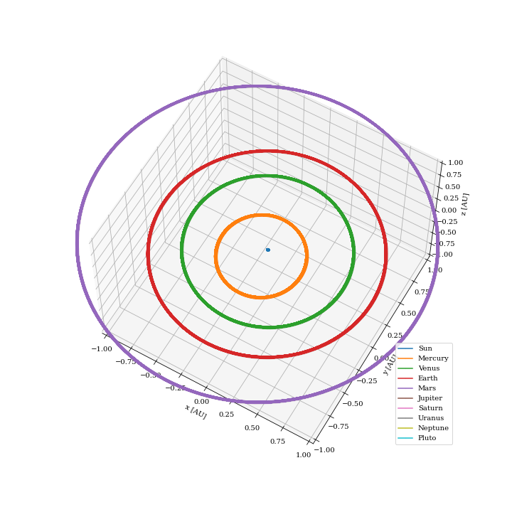

# PHYS 5070 Final Project &mdash; An n-body simulation of the solar system to verify the total precession of Mercury.

#### Author: Kirk Long


## The idea:

I've built a toy n-body simulator pretty much entirely from scratch that I'm using to simulate the solar system. My (perhaps overly optimistic) idea was that I'd be able to recover the precession of Mercury's orbit from the influence of the outer planets as well as general relativity. 

For reference, the observed total precession of Mercury's perihelion is ~5.75"/year. Newtonian/Keplerian dynamics from the outer planets account for 5.32"/year of this total value, but the remaining 0.43"/year was not explained until the advent of general relativity! I hope to recover both of these contributions. 

## The process: 

I decided to try a mostly object oriented approach for this project as I don't usually do that (usually I prefer to work in Julia, which is more functional). The file [`classes.py`](classes.py) contains the functions that build these objects, culminating in the `system` class, which contains the entire "solar system" in my code. The `system` class has an `update` method that evolves the system forward in time according to a specified time step, with the option to choose between RK4 and a velocity-verlet integration scheme.

The file [`functions.py`](functions.py) contains the physics of the simulation, most importantly in the `Δr` function. This is what I numerically integrate, with force interactions between Newtonian/Keplerian bodies going as usual like 1/r^2. Relativity can also be "turned on" for this function for specified bodies of the system (in my case I turn on relativity for the Mercury-Sun interaction only) using a weak-field approximation of GR, where the mass of the orbiting body (i.e. a planet like Mercury) is much less than the mass of the central object (i.e. a star like our Sun).

In this case I use the following approximation ([equation 2 from Parsa+2017](https://www.eso.org/public/archives/announcements/pdf/ann17051a.pdf), but also given in many other places):


The first term is (as expected) the Newtonian form, whereas all the other terms are perturbations due to the curvature of space-time in GR caused by the Sun's large mass.

To simulate the solar system I first start with initial conditions from JPL in the ecliptic reference frame, queried via emailed jobs to horizons@ssd.jpl.nasa.gov like: 

```
!$$SOF
EMAIL_ADDR=''
START_TIME = '2022-Apr-13 17:30:58'
STOP_TIME = '2022-Apr-13 17:30:59'
TABLE_TYPE = 'Vector'
REF_PLANE = 'Ecliptic'
CENTER = '@010'
COMMAND='301'
!$$EOF
```

Where `command` is the solar system body we want to retrieve data for (199 = Mercury, 299 = Venus, 399 = Earth, 301 = the Moon, etc.). This returns the most up-to-date ephemeride data (and much more), of which we use initial x,y,z,vx,vy,vz parameters. 

After inputting these initial parameters I then evolve the solar system in time. After the time evolution has finished I use Mercury's known longitude of ascending node, argument of perihelion, and inclination from the ecliptic to transform the coordinates into Mercury's orbital frame. I then find the point of periapsis for each orbit by calculating the set of minimum distances from the Sun in this frame, and I return the angle φ that corresponds to each. We can then plot this angle over time to see how it evolves, as this indicates precession! Since the precession is quite small over a single orbital period we have to integrate for long time scales to resolve this, and there is some inherent numerical noise related to the timestep as we will not always exactly sample where perihelion occurs. 

To calculate the total precession of Mercury we complete the above procedure using the "full" solar system, and to calculate just the effects from GR we simulate just the Sun-Mercury system.

## Tests:
Validation tests were performed on both integration schemes for the following cases:

1. Calculating the Earth's orbit in just a two-body interaction without relativity, and confirming that the periodicity is one year.
2. Calculating the Earth's orbit in the full n-body simulation without relativity, and again conforming that the periodicity is one year.
3. Calculating the Earth's orbit in just a two-body interaction with relativity turned on, and confirming that this does not affect the orbit.
4. Calculating Mercury's orbit in just a two-body interaction with relativity turned on, and confirming that this *does* change the orbit.

These tests + resulting plots can be found in the [`tests.ipynb`](tests.ipynb) notebook.

It also looks fine by eye -- here's an example of the solar system integrated for 250 years (to capture Pluto's orbit) output by the code: 




## Results: 

Sadly, this code is I think too slow / the integrator of too low order to recover the precession. I've spent the last two weeks trying to finagle it into working and I just can't get it to reproduce anything sensible. Here's a sample plot showing the "precession" of Mercury in the full solar system, integrated over 1,000 years with a timestep of 1e-4 times Mercury's orbital period. 


We can see that there's some sort of "scanning" effect, which I think is due to the simulation not having a point exactly at perihelion at each orbit, thus it bounces around in cycles related to the timestep. I've included a fit to the bulk "pattern", but you can see it's very poor, and the value is too low in this case (we would expect a total precession rate of ~2.8e-5 rad/year from the planets + relativity). 

I did try to run one more at extremely high precision, capturing just two orbits with a timestep equal to 1e-7 * Mercury's period with all of the planets. The fit here is (if believable) better, as it's at least the right order of magnitude (10^-5), but it's in the wrong direction? This version included all of the planets, so I thought about running it again with just Mercury but it took ~20 hours to do this one so I unfortunately don't think I have time...


All of the figures + general process were generated with the [`results.ipynb`](results.ipynb) notebook.

## Conclusions: 

This is harder than I thought it was going to be...and I can't find an example of this working successfully on the internet. I found a few people who had done just the GR bit, but they all relied on fancier packages (i.e. Rebound) to integrate / simulate for them, and I wanted to see if I could do everything myself. In comparing between that kind of code and mine though it does seem like there aren't any obvious errors, so it is likely just this integration/timestepping issue. If I had more time I might try to implement one of these fancier integration schemes but I'm basically out of time and have already spent way too long messing with this so I'm calling it a day.

